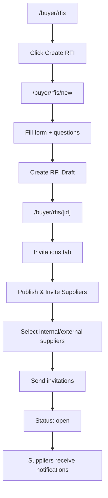
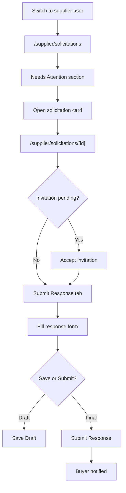
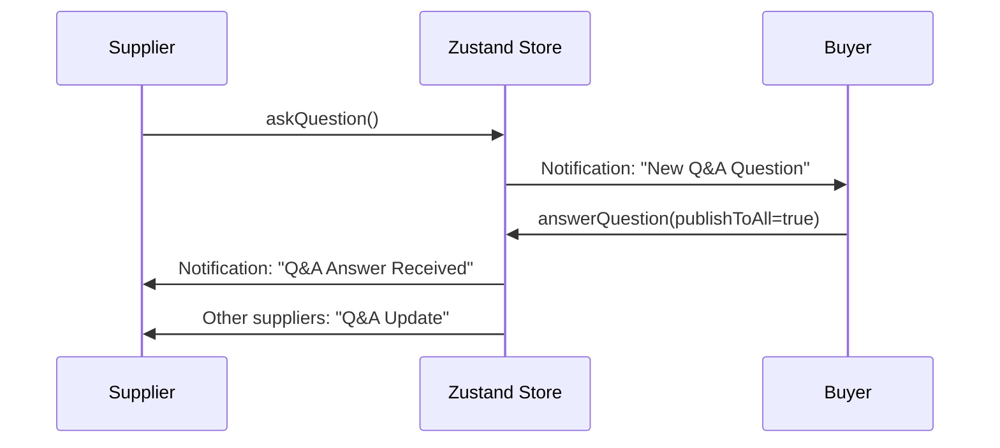
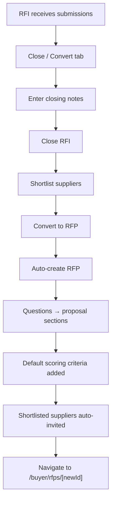
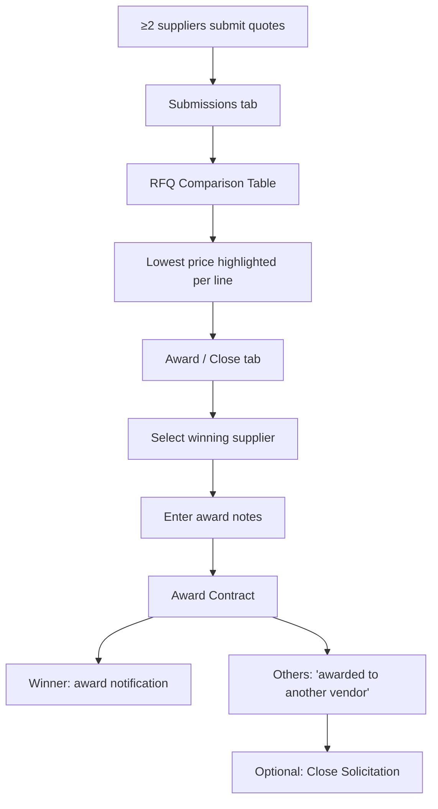

# RFX Procurement Portal — Prototype Documentation

> **Last updated:** June 15, 2026  
> **Version:** 0.1.0  
> **Status:** Frontend-only interactive prototype (no backend, no authentication)

This document describes the current state of the **RFX Procurement Portal** prototype — what has been built, how it works, what data it contains, and what is intentionally out of scope.

---

## Table of Contents

1. [Executive Summary](#executive-summary)
2. [What This Prototype Demonstrates](#what-this-prototype-demonstrates)
3. [Quick Start](#quick-start)
4. [Architecture Overview](#architecture-overview)
5. [Technology Stack](#technology-stack)
6. [Project Structure](#project-structure)
7. [User Roles & Demo Personas](#user-roles--demo-personas)
8. [Application Routes](#application-routes)
9. [Buyer Experience](#buyer-experience)
10. [Supplier Experience](#supplier-experience)
11. [End-to-End User Flows](#end-to-end-user-flows)
12. [Data Model](#data-model)
13. [State Management](#state-management)
14. [Status System](#status-system)
15. [Seed Data Inventory](#seed-data-inventory)
16. [Component Reference](#component-reference)
17. [Notifications & Activity Log](#notifications--activity-log)
18. [What Is Fully Implemented](#what-is-fully-implemented)
19. [What Is Not Implemented / Known Limitations](#what-is-not-implemented--known-limitations)
20. [Suggested Demo Walkthroughs](#suggested-demo-walkthroughs)

---

## Executive Summary

The **RFX Procurement Portal** is a Next.js-based prototype that simulates a two-sided procurement platform. Buyers at **Stimulus Procurement** create and manage solicitations (RFI, RFQ, RFP), invite suppliers, answer questions, review submissions, score proposals, and award contracts. Suppliers receive invitations, accept/decline, ask questions, and submit responses.

**Key characteristics:**

| Aspect | Detail |
|--------|--------|
| **Scope** | Full UI/UX for buyer and supplier workflows |
| **Persistence** | Browser `localStorage` via Zustand persist middleware |
| **Auth** | Demo user switcher (11 pre-seeded personas) |
| **Backend** | None — all logic runs client-side |
| **Data** | 17 pre-loaded solicitations with realistic scenarios |

The prototype is designed for **demos, usability testing, and stakeholder review** — not production deployment.

---

## What This Prototype Demonstrates

### Procurement document types

| Type | Full Name | Purpose in Prototype |
|------|-----------|----------------------|
| **RFI** | Request for Information | Market discovery via questionnaires; can be closed, shortlisted, and converted to RFP |
| **RFQ** | Request for Quotation | Line-item pricing; side-by-side price comparison for buyers |
| **RFP** | Request for Proposal | Structured proposal sections with weighted scoring criteria |

### Core capabilities

- Create solicitations (draft state)
- Publish by inviting suppliers (internal directory + external contacts)
- Supplier invitation accept/decline
- Q&A threads between suppliers and buyers
- Draft and final response submissions
- RFP scoring by buyers
- RFQ price comparison matrix
- RFI shortlisting and conversion to RFP
- Contract award and solicitation close
- In-app notifications and activity audit trail
- Role switching for cross-persona demos
- Demo reset to restore seed data

---

## Quick Start

### Prerequisites

- **Node.js v22.14.0** (recommended per project convention)

### Run locally

```bash
npm install
npm run dev
```

Open [http://localhost:3000](http://localhost:3000).

### Default experience

- App loads as **Jonathan Park** (`buyer-1`) — a buyer at Stimulus Procurement
- Home page (`/`) auto-redirects based on role:
  - Buyers → `/buyer/rfis`
  - Suppliers → `/supplier/solicitations`

### Demo controls (global header)

| Control | Action |
|---------|--------|
| **Reset Demo** | Restores all data to original seed state |
| **Notification bell** | Shows unread notifications with deep links |
| **User Switcher** | Switch between any of 11 demo users |

---

## Architecture Overview

```
┌─────────────────────────────────────────────────────────────────┐
│                        Browser (Client)                         │
├─────────────────────────────────────────────────────────────────┤
│  Next.js App Router (React 19 Client Components)                │
│                                                                 │
│  ┌──────────────┐  ┌──────────────┐  ┌──────────────────────┐  │
│  │ Buyer Pages  │  │Supplier Pages│  │  Global Header         │  │
│  │ /buyer/*     │  │/supplier/*   │  │  User Switcher         │  │
│  └──────┬───────┘  └──────┬───────┘  │  Notifications       │  │
│         │                 │          │  Reset Demo            │  │
│         └────────┬────────┘          └──────────┬─────────────┘  │
│                  │                              │                │
│                  ▼                              ▼                │
│         ┌────────────────────────────────────────────┐         │
│         │           Zustand Store (useStore)          │         │
│         │  users, rfxRecords, invitations, qaThreads, │         │
│         │  submissions, notifications, activityLog    │         │
│         └────────────────────┬───────────────────────┘         │
│                              │                                  │
│                              ▼                                  │
│         ┌────────────────────────────────────────────┐         │
│         │   localStorage: "rfx-portotype-store"       │         │
│         └────────────────────────────────────────────┘         │
└─────────────────────────────────────────────────────────────────┘

No API layer · No database · No server-side business logic
```

### Rendering model

- All interactive pages use `"use client"` directives
- Root layout wraps the app in `StoreProvider` (handles localStorage hydration)
- Buyer layout adds a sidebar navigation; supplier layout is full-width
- No API routes, middleware, or server actions exist

---

## Technology Stack

| Layer | Technology | Version | Usage |
|-------|-----------|---------|-------|
| Framework | Next.js (App Router) | 16.2.9 | Routing, layouts, metadata |
| UI Library | React | 19.2.4 | Client components |
| State | Zustand + persist | 5.0.14 | Global store + localStorage |
| Styling | Tailwind CSS | 4.x | Utility-first CSS |
| Components | shadcn (base-nova) + @base-ui/react | 4.11.0 / 1.5.0 | Dialog, Tabs, Select, etc. |
| Icons | lucide-react | 1.18.0 | UI icons |
| Dates | date-fns | 4.4.0 | Formatting, relative time |
| Toasts | sonner | 2.0.7 | Action feedback |
| Fonts | Poppins + Geist Mono | via next/font | Typography |
| Utilities | clsx, tailwind-merge, cva | — | Class composition |

**Note:** `next-themes` is installed and used in the Sonner toaster, but no `ThemeProvider` is mounted — dark mode CSS tokens exist but there is no UI toggle. The `uuid` package is listed in dependencies but unused (IDs are generated inline).

---

## Project Structure

```
src/
├── app/                          # Next.js App Router
│   ├── layout.tsx                # Root layout (header, store provider, toaster)
│   ├── page.tsx                  # Role-based redirect
│   ├── globals.css               # Theme tokens + Tailwind
│   ├── buyer/
│   │   ├── layout.tsx            # Sidebar: My RFIs / RFQs / RFPs
│   │   ├── rfis/                 # List, new, [id] detail
│   │   ├── rfqs/                 # List, new, [id] detail
│   │   └── rfps/                 # List, new, [id] detail
│   └── supplier/
│       ├── layout.tsx            # Full-width layout (no sidebar)
│       └── solicitations/        # Dashboard + [id] detail
│
├── components/
│   ├── layout/                   # AppHeader, SideNav, UserSwitcher, NotificationFeed
│   ├── providers/                # StoreProvider (hydration)
│   ├── rfx/                      # Buyer domain: lists, hub, tabs, forms
│   ├── supplier/                 # Supplier cards + submission forms
│   └── ui/                       # shadcn primitives (button, card, dialog, etc.)
│
├── hooks/
│   └── use-supplier-dashboard.ts # Buckets solicitations for supplier dashboard
│
└── lib/
    ├── types.ts                  # All TypeScript interfaces
    ├── store.ts                  # Zustand store + actions + selectors
    ├── seed-data.ts              # Pre-loaded demo data (~527 lines)
    ├── rfx-status.ts             # Derived display status logic
    ├── format.ts                 # Date/currency formatters
    └── utils.ts                  # cn() class helper
```

**Total:** 64 source files under `src/`.

---

## User Roles & Demo Personas

### Buyers (3 users)

| ID | Name | Email | Organization |
|----|------|-------|--------------|
| `buyer-1` | Jonathan Park | jonathan@stimulus.com | Stimulus Procurement |
| `buyer-2` | Carlos Mendez | carlos@stimulus.com | Stimulus Procurement |
| `buyer-3` | Evren Aksoy | evren@stimulus.com | Stimulus Procurement |

**Default user:** `buyer-1` (Jonathan Park)

### Suppliers (8 users)

| ID | Name | Organization | Diversity Tag |
|----|------|--------------|---------------|
| `supplier-1` | Alex Rivera | GlobalTech Solutions | — |
| `supplier-2` | Jordan Lee | Nexus Industries | MBE |
| `supplier-3` | Sam Patel | Brightline Systems | WBE |
| `supplier-4` | Maria Santos | Apex Logistics | — |
| `supplier-5` | David Kim | GreenLeaf Co | SBE |
| `supplier-6` | Priya Sharma | Meridian Tech | MBE |
| `supplier-7` | Chris Wong | Summit Solutions | — |
| `supplier-8` | Taylor Brooks | Coastal Partners | — |

### Role switching behavior

When switching users via the header dropdown:
- **Buyer** → navigates to `/buyer/rfis`
- **Supplier** → navigates to `/supplier/solicitations`

---

## Application Routes

### Route map

```
/                                    → Redirect by role
│
├── /buyer/
│   ├── /rfis                        → RFI list (filtered)
│   ├── /rfis/new                    → Create RFI form
│   ├── /rfis/[id]                   → RFI detail hub (6 tabs)
│   ├── /rfqs                        → RFQ list
│   ├── /rfqs/new                    → Create RFQ form
│   ├── /rfqs/[id]                   → RFQ detail hub
│   ├── /rfps                        → RFP list
│   ├── /rfps/new                    → Create RFP form
│   └── /rfps/[id]                   → RFP detail hub
│
└── /supplier/
    ├── /solicitations               → Supplier dashboard (grouped sections)
    └── /solicitations/[id]        → Single solicitation detail (4 tabs)
```

### Buyer sidebar navigation

Defined in `src/app/buyer/layout.tsx`:

- **My RFIs** → `/buyer/rfis`
- **My RFQs** → `/buyer/rfqs`
- **My RFPs** → `/buyer/rfps`

---

## Buyer Experience

### List pages (`/buyer/rfis`, `/buyer/rfqs`, `/buyer/rfps`)

Shared component: `BuyerListPage`

**Features:**
- Page title and type-specific description
- **Create {RFI|RFQ|RFP}** button → `/new`
- **Status filter pills** with live counts:
  - All
  - Created by me (current user)
  - Type-specific derived statuses (see [Status System](#status-system))
- **Card list** showing:
  - Type badge (RFI / RFQ / RFP)
  - Derived display status
  - Deadline badge (e.g., "7 days left", "Overdue", "Due today")
  - Late-draft badge (draft past due date)
  - RFP origin badge (if converted from RFI)
  - Owner attribution and last actor
  - Description excerpt
  - Due date and invitation count
- Empty state when no records match filter
- Sorted by most recently updated

### Create pages (`/buyer/*/new`)

#### Create RFI (`CreateRfiForm`)

| Field | Details |
|-------|---------|
| Title | Required text |
| Description | Required textarea |
| Due Date | Date picker |
| Questions | Dynamic list — add/remove |
| Question fields | Text, type (text / textarea / yes_no), required toggle |

**On submit:** Creates draft RFI → redirects to `/buyer/rfis/[id]`

#### Create RFQ (`CreateRfqForm`)

| Field | Details |
|-------|---------|
| Title, Description, Due Date | Same as RFI |
| Line Items | Dynamic list — add/remove |
| Line item fields | Description, quantity, unit, optional estimated unit price |

**On submit:** Creates draft RFQ → redirects to `/buyer/rfqs/[id]`

#### Create RFP (`CreateRfpForm`)

| Field | Details |
|-------|---------|
| Title, Description, Due Date | Same as above |
| Proposal Sections | Dynamic — title, description, required toggle |
| Scoring Criteria | Dynamic — name, description, max points, weight % |

**On submit:** Creates draft RFP → redirects to `/buyer/rfps/[id]`

### Detail hub (`/buyer/rfis|rfqs|rfps/[id]`)

Shared shell: `RfxHubHeader` + `RfxHubTabs`

**Header shows:**
- Type, status, deadline, and late-draft badges
- RFP origin link (if converted from RFI)
- Title, description, due date
- Owner name and last activity actor

**Six tabs:**

#### 1. Overview (`OverviewTab`)

- Summary stat cards: invitations sent, submissions received, Q&A count
- Type-specific structure preview:
  - **RFI:** Question list with types and required flags
  - **RFQ:** Line items table with quantities and estimated prices
  - **RFP:** Sections list + scoring criteria with weights

#### 2. Invitations (`InvitationsTab`)

- **Publish & Invite Suppliers** (for drafts) or **Invite More** (for open solicitations)
- Opens `InviteSuppliersDialog` (multi-step flow)
- Lists all invitations with status: pending / accepted / declined
- Shows internal suppliers (from directory) and external contacts

**Invite dialog flow:**

```
Step 1: Choose
  ├── Invite Internal Suppliers (directory search + checkboxes)
  └── Invite External Suppliers (name, email, company rows)

Step 2: Review & Send
  └── Sends invitations; if draft → publishes to "open" status
```

#### 3. Q&A (`QaTabBuyer`)

- Lists all supplier questions on this solicitation
- Buyer can answer each question
- **Publish to all suppliers** toggle (default: on)
- Shows answered vs unanswered state

#### 4. Submissions (`SubmissionsTab`)

- Lists submitted responses per supplier
- Lists draft submissions separately
- **RFQ-specific:** `RfqComparisonTable` — side-by-side price matrix when ≥2 submitted quotes; highlights lowest price per line item
- **RFP-specific:** Scoring UI — enter score per criterion, save total score

#### 5. Award / Close (`AwardCloseTab`)

Behavior varies by type:

**RFI — "Close / Convert" tab:**
1. Enter closing notes → **Close RFI**
2. Toggle **Shortlist** on accepted suppliers
3. **Convert to RFP** (only when closed) — auto-creates RFP from RFI questions as sections, invites shortlisted suppliers

**RFQ / RFP — "Award / Close" tab:**
1. Select winning supplier from submitted responses
2. Enter award notes → **Award Contract**
3. Winner receives award notification; other invited suppliers notified
4. **Close Solicitation** (after award or independently)

#### 6. Activity Log (`ActivityTab`)

- Chronological audit trail for the solicitation
- Shows action, details, actor name, timestamp

---

## Supplier Experience

### Dashboard (`/supplier/solicitations`)

Uses `useSupplierDashboard` hook to bucket invited solicitations:

| Section | Contents |
|---------|----------|
| **Needs Attention** | Pending invitations, unread notifications, draft in progress, response needed |
| **Active** | Open solicitations supplier is participating in |
| **My Q&A** | Solicitations where supplier has unanswered questions |
| **My Submissions** | Solicitations where supplier has submitted a response |
| **Closed** | Closed or awarded solicitations |

Each item renders as a `SolicitationCard` linking to `/supplier/solicitations/[id]`.

### Detail page (`/supplier/solicitations/[id]`)

**Header:**
- Type and status badges
- Title, description, due date
- Buyer organization name

**Pending invitation banner** (if applicable):
- Accept / Decline buttons

**Four tabs:**

| Tab | Features |
|-----|----------|
| **Overview** | Metadata, public answered Q&A threads |
| **Ask a Question** | Submit new question; view own Q&A history (disabled when closed/awarded) |
| **Submit Response** | Gated on accepted invitation; type-specific form (see below) |
| **Notifications** | Per-solicitation notifications; click to mark read |

### Submission forms (`SupplierSubmissionForm`)

Gated requirements:
- Must have **accepted** invitation
- Disabled when solicitation is **closed** or **awarded**
- Read-only after **submitted**

#### RFI response
- One input per question (text, textarea, or yes/no select)
- **Save Draft** / **Submit Response**

#### RFQ response
- Unit price (+ optional notes) per line item
- **Save Draft** / **Submit Response**

#### RFP response
- Textarea per proposal section
- **Attach file (demo)** — adds fake filename chips only (no real upload)
- **Save Draft** / **Submit Response**

---

## End-to-End User Flows

### Flow 1: Buyer creates and publishes an RFI



**Steps:**
1. Navigate to My RFIs
2. Click **Create RFI**
3. Fill title, description, due date, add questions
4. Submit → lands on detail page (draft)
5. Go to **Invitations** tab → **Publish & Invite Suppliers**
6. Select suppliers → send
7. RFI status becomes `open`; invited suppliers get in-app notifications

---

### Flow 2: Supplier responds to a solicitation



**Steps:**
1. Use **User Switcher** → pick a supplier (e.g., Alex Rivera)
2. Dashboard shows pending items in **Needs Attention**
3. Open solicitation → accept invitation if pending
4. Go to **Submit Response** tab
5. Fill answers/quotes/proposal → **Submit Response**
6. Buyer receives notification

---

### Flow 3: Buyer Q&A cycle



---

### Flow 4: RFI → RFP conversion



**Conversion logic** (`convertRfiToRfp` in store):
- Requires RFI status = `closed`
- Maps each RFI question → RFP section ("Requirement N")
- Adds default criteria: "Overall Fit" (50 pts) + "Cost" (50 pts)
- Sets `linkedFromRfiId` on new RFP
- Sets `convertedToRfpId` on source RFI
- Auto-publishes to shortlisted suppliers if any

---

### Flow 5: RFQ award with price comparison



**Demo data:** `rfq-1` (Q2 Laptop Procurement) has 2 submitted quotes from GlobalTech and Nexus — ideal for demonstrating comparison.

---

### Flow 6: RFP scoring and award

1. Suppliers submit RFP responses (multiple sections)
2. Buyer reviews in **Submissions** tab
3. Enter scores per scoring criterion → **Save Scores** (computes `totalScore`)
4. **Award / Close** tab → select supplier → award

**Demo data:** `rfp-1` (Enterprise ERP Implementation) has 1 submitted + 1 draft response.

---

### Flow 7: Cross-role demo

1. Start as buyer → perform action (publish, answer Q&A)
2. **User Switcher** → switch to affected supplier
3. See notification in bell icon or supplier dashboard
4. **Reset Demo** anytime to restore seed data

---

## Data Model

All types are defined in `src/lib/types.ts`.

### Core entities

```
User
├── id, name, email, role, organization
└── diversityTag? (MBE, WBE, SBE)

RfxRecord (discriminated union)
├── RfiRecord
│   ├── questions: RfiQuestion[]
│   ├── closeNotes?, shortlistedSupplierIds[]
│   └── convertedToRfpId?
├── RfqRecord
│   ├── lineItems: RfqLineItem[]
│   └── awardedSupplierId?, awardNotes?
└── RfpRecord
    ├── sections: RfpSection[]
    ├── scoringCriteria: ScoringCriterion[]
    ├── awardedSupplierId?, awardNotes?
    └── linkedFromRfiId?

Invitation
├── supplierType: internal | external
├── supplierId? (internal) or externalContact? (external)
└── status: pending | accepted | declined

QaThread
├── question, answer?, isPublic
└── supplierId, rfxId

Submission
├── status: draft | submitted
├── rfiAnswers? | rfqQuotes? | rfpResponses?
├── criterionScores?, totalScore?
└── attachments? (demo filename chips)

Notification
├── title, message, type, read
└── userId, rfxId

ActivityEntry
├── action, details
└── rfxId, userId
```

### RfxBase fields (shared by all types)

| Field | Type | Description |
|-------|------|-------------|
| `id` | string | Unique identifier (e.g., `rfi-1`, `rfq-3`) |
| `type` | RfxType | RFI, RFQ, or RFP |
| `title` | string | Solicitation title |
| `description` | string | Full description |
| `status` | RfxStatus | draft, published, open, closed, awarded |
| `buyerId` | string | Owning buyer user ID |
| `createdAt` | ISO string | Creation timestamp |
| `updatedAt` | ISO string | Last update timestamp |
| `dueDate` | ISO string | Response deadline |
| `publishedAt` | ISO string? | When first published |
| `closedAt` | ISO string? | When closed |

---

## State Management

### Store architecture

- **Library:** Zustand 5 with `persist` middleware
- **Storage key:** `rfx-portotype-store`
- **Hydration:** `StoreProvider` calls `useStore.persist.rehydrate()` on mount; shows "Loading..." until ready
- **Initial state:** `SEED_DATA` from `src/lib/seed-data.ts`

### Store actions

| Category | Action | Description |
|----------|--------|-------------|
| **User** | `setCurrentUser(userId)` | Switch active demo persona |
| | `resetStore()` | Restore `SEED_DATA` |
| **Create** | `createRfi(data)` | New draft RFI; returns ID |
| | `createRfq(data)` | New draft RFQ; returns ID |
| | `createRfp(data)` | New draft RFP; returns ID |
| **Lifecycle** | `updateRfx(id, updates)` | Partial update any RFX field |
| | `publishRfx(id, supplierIds)` | Wrapper for `sendInvitations` |
| | `closeRfi(id, closeNotes)` | Close RFI with notes |
| | `closeRfx(id)` | Close RFQ/RFP |
| | `toggleShortlist(rfiId, supplierId)` | Add/remove from RFI shortlist |
| | `convertRfiToRfp(rfiId)` | Create linked RFP; returns new ID |
| | `awardRfx(id, supplierId, notes)` | Award contract; notify parties |
| **Invitations** | `inviteSuppliers(rfxId, supplierIds)` | Invite internal suppliers |
| | `sendInvitations(rfxId, payload)` | Internal + external invites; publishes if draft |
| | `respondInvitation(id, status)` | Supplier accept/decline |
| **Q&A** | `askQuestion(rfxId, supplierId, question)` | Supplier asks; notifies buyer |
| | `answerQuestion(qaId, answer, buyerId, publishToAll?)` | Buyer answers; notifies suppliers |
| **Submissions** | `saveSubmission(submission)` | Upsert draft or update |
| | `submitResponse(submissionId)` | Mark submitted; notify buyer |
| | `scoreSubmission(id, scores, buyerId)` | Save RFP criterion scores |
| **Notifications** | `markNotificationRead(id)` | Mark single notification read |
| | `addNotification(data)` | Create notification |
| **Audit** | `logActivity(entry)` | Append activity log entry |

### Selector helpers

| Function | Returns |
|----------|---------|
| `getCurrentUser(state)` | Active user object |
| `getSuppliers(state)` | All supplier users |
| `getBuyers(state)` | All buyer users |
| `getRfxByType(state, type)` | RFX records filtered by type |
| `getSupplierInvitations(state, supplierId)` | Invitations for a supplier |
| `getRfxInvitations(state, rfxId)` | Invitations for a solicitation |
| `getRfxSubmissions(state, rfxId)` | Submissions for a solicitation |
| `getRfxQa(state, rfxId)` | Q&A threads for a solicitation |
| `getUserNotifications(state, userId)` | Notifications sorted by date |
| `getRfxActivity(state, rfxId)` | Activity log sorted by date |
| `getSupplierSubmission(state, rfxId, supplierId)` | Single supplier's submission |

---

## Status System

The prototype uses **two layers** of status:

### 1. Raw status (`RfxStatus` — stored in data)

| Status | Meaning |
|--------|---------|
| `draft` | Created but not yet published |
| `published` | In type system; publish flow sets `open` directly |
| `open` | Published and active |
| `closed` | Solicitation closed |
| `awarded` | Contract awarded (RFQ/RFP) |

### 2. Derived display status (computed in `rfx-status.ts`)

Used for list filters and badges — richer than raw status.

**RFI display statuses:**

| Status | When shown |
|--------|------------|
| `draft` | Raw status is draft |
| `published` | Open, invitations sent, no Q&A activity yet |
| `qa_open` | Has unanswered supplier questions |
| `responses` | Has draft or submitted responses |
| `closed` | Raw status is closed |

**RFQ/RFP display statuses:**

| Status | When shown |
|--------|------------|
| `draft` | Raw status is draft |
| `published` | Open, invitations sent, no Q&A yet |
| `qa_open` | Has unanswered questions |
| `submissions_open` | Has draft or submitted responses |
| `awarded` | Raw status is awarded |
| `closed` | Raw status is closed |

### Additional badges

| Badge | Logic |
|-------|-------|
| **Deadline** | "Overdue", "Due today", "N days left" (within 7 days) |
| **Late Draft** | Draft status + due date in the past |
| **RFP Origin** | RFP with `linkedFromRfiId` — links back to source RFI |

---

## Seed Data Inventory

Pre-loaded in `src/lib/seed-data.ts`. Dates are relative to load time (`daysAgo` / `daysFromNow`).

### RFX Records (17 total)

#### RFIs (5)

| ID | Title | Status | Scenario |
|----|-------|--------|----------|
| `rfi-1` | Cloud Infrastructure Capabilities Assessment | open | Q&A open — unanswered FedRAMP question |
| `rfi-2` | Office Furniture Vendor Discovery | closed | Shortlisted + converted to `rfp-6` |
| `rfi-3` | Cybersecurity Services Landscape | draft | Late draft (due date passed) |
| `rfi-4` | Facilities Management Providers | open | Just published, pending invitation |
| `rfi-5` | Print Services Vendor Survey | open | Responses received (2 submissions) |

#### RFQs (6)

| ID | Title | Status | Scenario |
|----|-------|--------|----------|
| `rfq-1` | Q2 Laptop Procurement | open | 2 submitted quotes — price comparison demo |
| `rfq-2` | Office Cleaning Services | awarded | Awarded to Brightline Systems |
| `rfq-3` | Network Switch Replacement | draft | Unpublished draft |
| `rfq-4` | Conference Room AV Equipment | open | Includes 1 external contact invite |
| `rfq-5` | Uniform & Apparel Supply | open | Q&A open — unanswered question |
| `rfq-6` | Parking Lot Resurfacing | closed | Historical closed RFQ |

#### RFPs (6)

| ID | Title | Status | Scenario |
|----|-------|--------|----------|
| `rfp-1` | Enterprise ERP Implementation | open | Q&A + submissions (1 submitted, 1 draft) |
| `rfp-2` | Managed Security Services | closed | Previously awarded to GlobalTech |
| `rfp-3` | Marketing Agency Partnership | draft | Unpublished draft |
| `rfp-4` | HR Benefits Administration Platform | open | Just published, pending invitations |
| `rfp-5` | Data Warehouse Modernization | awarded | Awarded to Meridian Tech |
| `rfp-6` | Office Furniture Vendor Discovery (RFP) | open | Converted from `rfi-2` |

### Related seed data counts

| Entity | Count |
|--------|-------|
| Invitations | 23 (22 internal + 1 external) |
| Q&A threads | 5 (2 unanswered) |
| Submissions | 9 (mix of draft and submitted) |
| Notifications | 8 |
| Activity log entries | 10 |

---

## Component Reference

### Layout components

| Component | File | Purpose |
|-----------|------|---------|
| `AppHeader` | `layout/app-shell.tsx` | Logo, Reset Demo, notifications, user switcher |
| `SideNav` | `layout/app-shell.tsx` | Buyer sidebar navigation |
| `PageLayout` | `layout/app-shell.tsx` | Sidebar + main content wrapper |
| `UserSwitcher` | `layout/user-switcher.tsx` | Demo persona dropdown |
| `NotificationFeed` | `layout/notification-feed.tsx` | Bell icon + notification dropdown with deep links |
| `StoreProvider` | `providers/store-provider.tsx` | Zustand hydration gate |

### Buyer RFX components

| Component | Purpose |
|-----------|---------|
| `BuyerListPage` | Shared list page with filters |
| `RfxList` | Clickable card list |
| `StatusFilter` | Pill filter bar with counts |
| `RfxHubHeader` | Detail page header with badges |
| `RfxHubTabs` | Six-tab shell for detail pages |
| `RfxBadges` | Status, type, origin, deadline, attribution badges |
| `InviteSuppliersDialog` | Multi-step internal/external invite flow |
| `RfqComparisonTable` | Side-by-side RFQ price matrix |
| `CreateRfiForm` / `CreateRfqForm` / `CreateRfpForm` | Creation forms |
| `OverviewTab` | Stats + structure preview |
| `InvitationsTab` | Invitation management |
| `QaTabBuyer` | Buyer Q&A answering |
| `SubmissionsTab` | Review + score submissions |
| `AwardCloseTab` | Close/award/convert workflows |
| `ActivityTab` | Activity log display |

### Supplier components

| Component | Purpose |
|-----------|---------|
| `SolicitationCard` | Dashboard card with status badge |
| `SupplierSubmissionForm` | RFI/RFQ/RFP response forms |

### UI primitives (`components/ui/`)

shadcn/Base UI wrappers: `alert`, `avatar`, `badge`, `button`, `card`, `checkbox`, `dialog`, `dropdown-menu`, `input`, `label`, `link-button`, `scroll-area`, `select`, `separator`, `sonner`, `switch`, `table`, `tabs`, `textarea`.

---

## Notifications & Activity Log

### Notification types

| Type | Color/Style | Examples |
|------|-------------|----------|
| `info` | Default | New invitation, Q&A question, Q&A update |
| `success` | Green | New submission received |
| `warning` | Amber | — |
| `award` | Gold | Contract awarded |

### Events that trigger notifications

| Event | Recipient |
|-------|-----------|
| Invitation sent | Invited supplier(s) |
| Supplier asks question | Buyer |
| Buyer answers question | Asking supplier (+ all invited if published) |
| Supplier submits response | Buyer |
| Contract awarded | Winning supplier |
| Contract awarded to other | Other invited suppliers |

### Activity log actions

Examples: `Created RFI`, `Published`, `Invited Suppliers`, `Asked Question`, `Answered Question`, `Submitted Response`, `Scored Submission`, `Awarded`, `Closed RFI`, `Closed`, `Converted to RFP`

---

## What Is Fully Implemented

These features are **functional end-to-end** within the client-side prototype:

- [x] RFI, RFQ, RFP creation (draft)
- [x] Publish via invitation flow (draft → open)
- [x] Internal supplier directory invitations
- [x] External contact invitations (stored, displayed)
- [x] Supplier invitation accept/decline
- [x] Q&A ask and answer with publish-to-all toggle
- [x] Draft and final submissions for all three types
- [x] RFP scoring by buyer (per criterion + total)
- [x] RFQ side-by-side price comparison (≥2 submissions)
- [x] RFI shortlist management
- [x] RFI → RFP conversion with auto-invite
- [x] Contract award with winner/loser notifications
- [x] Solicitation close (RFI, RFQ, RFP)
- [x] Activity log on every major action
- [x] In-app notification feed with deep links
- [x] Status filtering with derived display statuses
- [x] Deadline and late-draft badges
- [x] localStorage persistence across browser sessions
- [x] Demo user switching (11 personas)
- [x] Demo reset to seed data
- [x] Toast feedback on all major actions
- [x] Responsive layout (sidebar hidden on mobile)

---

## What Is Not Implemented / Known Limitations

| Area | Status | Notes |
|------|--------|-------|
| **Authentication** | Not implemented | Demo user picker only |
| **Backend / API** | Not implemented | All data in-memory + localStorage |
| **Database** | Not implemented | No persistence beyond browser |
| **Real file uploads** | Stub only | RFP "Attach file" adds fake filename chips |
| **External supplier portal** | Not implemented | External invites stored but no login/view |
| **Edit existing RFX** | Not implemented | Cannot edit title, questions, line items after creation |
| **Delete RFX** | Not implemented | No delete action |
| **Real email** | Not implemented | Notifications are in-app only |
| **`published` raw status** | Unused in practice | Publish flow sets `open` directly |
| **Dark mode toggle** | Not wired | CSS tokens exist; no ThemeProvider |
| **Automated tests** | None | No unit, integration, or E2E tests |
| **CI/CD** | None | No pipeline configuration |
| **RFQ price validation** | Not enforced | Can submit without all prices |
| **Multi-buyer permissions** | Not implemented | All buyers see all solicitations |
| **Supplier diversity reporting** | Display only | Tags shown but no reporting/filtering |
| **Concurrent editing** | N/A | Single-browser prototype |
| **README** | Boilerplate | Default create-next-app content |

---

## Suggested Demo Walkthroughs

### Walkthrough A: Full procurement cycle (RFQ)

**Time:** ~5 minutes

1. Start as **Jonathan Park** (buyer-1)
2. Go to **My RFQs** → open **Q2 Laptop Procurement** (`rfq-1`)
3. **Submissions** tab → show price comparison (GlobalTech vs Nexus)
4. **Award / Close** tab → award to GlobalTech → show toast
5. Switch to **Alex Rivera** (supplier-1) → check notification bell
6. Switch to **Jordan Lee** (supplier-2) → see "awarded to another vendor" notification

### Walkthrough B: RFI to RFP conversion

**Time:** ~5 minutes

1. As **Carlos Mendez** (buyer-2) → **My RFIs** → open **Office Furniture Vendor Discovery** (`rfi-2`)
2. Show it's already closed with shortlist and conversion link
3. Click **View source RFI** from **Office Furniture (RFP)** (`rfp-6`)
4. Show linked origin badge and auto-generated sections from RFI questions
5. Switch to **Alex Rivera** → see invitation to converted RFP

### Walkthrough C: Q&A and submission flow

**Time:** ~5 minutes

1. As **Jonathan Park** → **My RFIs** → **Cloud Infrastructure** (`rfi-1`)
2. **Q&A** tab → answer the FedRAMP question from Nexus
3. Switch to **Jordan Lee** (supplier-2) → dashboard → open RFI
4. **Ask a Question** tab → submit a new question
5. Switch back to buyer → answer the new question
6. As supplier → **Submit Response** tab → complete and submit

### Walkthrough D: Create from scratch

**Time:** ~3 minutes

1. As any buyer → **My RFIs** → **Create RFI**
2. Fill minimal form with 2 questions → create draft
3. **Invitations** tab → publish and invite 2 suppliers
4. Switch to invited supplier → accept → submit response
5. **Reset Demo** → confirm data restored

---

## Appendix: Environment & Scripts

```bash
npm run dev      # Start development server (localhost:3000)
npm run build    # Production build
npm run start    # Start production server
npm run lint     # ESLint
```

### Key configuration files

| File | Purpose |
|------|---------|
| `package.json` | Dependencies and scripts |
| `tsconfig.json` | TypeScript config; `@/*` → `src/*` |
| `components.json` | shadcn configuration (base-nova style) |
| `next.config.ts` | Next.js config (default/empty) |
| `src/app/globals.css` | CSS variables, theme tokens, Tailwind |

---

*This document reflects the prototype as of version 0.1.0. For questions or updates, refer to the source code in `src/` or reset the demo and explore interactively.*
